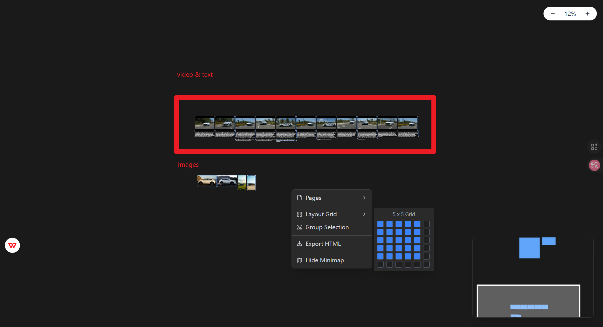

<h1 align="center">DataPureRef</h1>

DataPureRef 是一个基于 React 的高性能无限画布应用，旨在帮助用户以可视化的方式组织和管理多媒体数据（文本、图片、视频）。它采用本地优先（Local-First）的设计理念，支持数据的自动保存和离线导出。

[简体中文](./README.md) | [English](./README_EN.md)


## ✨ 核心特性

- **♾️ 无限画布 & 导航**
  - 支持无限制的平移和缩放操作。
  - **可视化导航图 (Minimap)**：实时概览全局视图，支持拖拽视口快速定位，滚轮缩放，点击跳转。支持最小化和通过右键菜单恢复。
  - 优化的渲染性能，流畅处理大量元素。
  - 网格背景辅助对齐。

- **📁 多媒体管理**
  - **文本**: 支持富文本编辑，文本框高度根据内容自动适配。
  - **图片 & 视频**: 支持拖拽上传，自由缩放和移动。
  - **智能导入**: 支持**文件夹拖拽导入**，自动识别目录下的图片、视频和文本文件。
  - **性能优化**: 视频文件自动生成缩略图，大幅提升大量视频场景下的渲染流畅度。

- **🎮 高效交互**
  - **框选多选**: 按住 `Shift` 键拖拽即可框选多个对象。
  - **网格布局**: 选中多个对象后，通过右键菜单的“Layout Grid”可使用可视化选择器快速进行网格排列。
  - **自动排列**: 选中多个对象后按下 `L` 键，自动按名称排序并整齐排列。
  - **快速重置**: 双击图片或视频可快速恢复原始比例。
  - **右键菜单**: 提供全局功能的快捷访问（如导出、显示导航图、布局调整）。

- **💾 数据安全与导出**
  - **自动保存**: 基于 IndexedDB 的本地持久化存储，刷新页面不丢失任何数据（包括大型视频文件）。
  - **独立导出**: 支持将当前画布一键导出为**单文件 HTML**。所有图片、视频均以 Base64 编码嵌入，无需外部依赖，直接在浏览器中打开即可交互（缩放、平移、播放）。



## 🛠️ 技术栈

- **核心框架**: [React 18](https://react.dev/), [TypeScript](https://www.typescriptlang.org/)
- **构建工具**: [Vite](https://vitejs.dev/)
- **样式方案**: [Tailwind CSS](https://tailwindcss.com/)
- **状态管理**: [Zustand](https://github.com/pmndrs/zustand)
- **交互手势**: [@use-gesture/react](https://github.com/pmndrs/use-gesture)
- **本地存储**: [idb-keyval](https://github.com/jakearchibald/idb-keyval) (IndexedDB Wrapper)

## 🚀 快速开始

### 前置要求
- Node.js (推荐 v16+)
- npm 或 yarn

### 安装步骤

1. **克隆仓库**
   ```bash
   git clone https://github.com/Reginald-L/DataPureRef.git
   cd DataPureRef
   ```

2. **安装依赖**
   ```bash
   npm install
   ```

3. **启动开发服务器**
   ```bash
   npm run dev
   ```
   访问终端中显示的地址（通常是 `http://localhost:5173`）。

4. **构建生产版本**
   ```bash
   npm run build
   ```

## 📖 操作指南

| 操作 | 说明 |
|------|------|
| **平移画布** | 按住 **鼠标中键** (滚轮) 并拖动，或按住 **Space** 键 + 左键拖动 |
| **缩放画布** | 滚动 **鼠标滚轮**，或使用底部工具栏的缩放控件 |
| **导航图** | 鼠标悬停右下角导航图可操作，拖拽白框移动视图；点击右上角 **X** 隐藏，**右键菜单**可恢复显示 |
| **上传文件** | 直接将 **文件** 或 **文件夹** 拖拽到画布任意位置 |
| **多选对象** | 按住 **Shift** 键并拖拽鼠标进行框选，或 Shift + 点击逐个选择；**Ctrl + A** 全选 |
| **移动对象** | 选中后直接拖动 |
| **调整大小** | 选中对象后，拖动四周的**控制手柄** |
| **重置大小** | **双击** 图片或视频对象 |
| **自动排列** | 选中多个对象后，按 **L** 键自动对齐排列 |
| **网格布局** | 选中多个对象后，**右键单击** -> **Layout Grid**，在可视化网格中选择行列数进行排列 |
| **全局菜单** | 在画布空白处 **右键单击**，可进行导出、显示导航图或调整布局 |
| **添加文本** | 点击底部工具栏的 **T** 图标 |


## 🤝 贡献

欢迎提交 Issue 或 Pull Request 来改进这个项目！

## ❤️ 致谢

本项目的设计灵感来源于 [PureRef](https://www.pureref.com/)。PureRef 是一款卓越的参考图像管理软件，为创意工作者提供了极大的便利。DataPureRef 致力于在 Web 端复刻并探索类似的流畅体验。在此向 PureRef 团队致以诚挚的谢意！

## 📄 许可证

本项目基于 MIT 许可证开源。
